# Unimeds

Book doctors at clinics near you, keep your medical records in one private place, and give clinics a calm way to run bookings, schedules and their team.

Unimeds is a multi-tenant healthcare SaaS with four roles.

| Role | What they get |
|---|---|
| **Patient** | Find doctors by name, specialty or location; book real open times; reschedule, cancel or answer a proposed new time; upload and share records per visit; export or delete their data |
| **Doctor** | Mobile-first day view, confirm / complete / no-show, propose new times, clinical notes, patient charts, weekly hours per clinic |
| **Clinic admin** | Overview and approval queue, front-desk booking, team invites and doctor schedules, patients and records, analytics, activity log, booking rules |
| **Super admin** | Onboard, suspend and reactivate clinics, manage users, platform activity, read-only audit log |

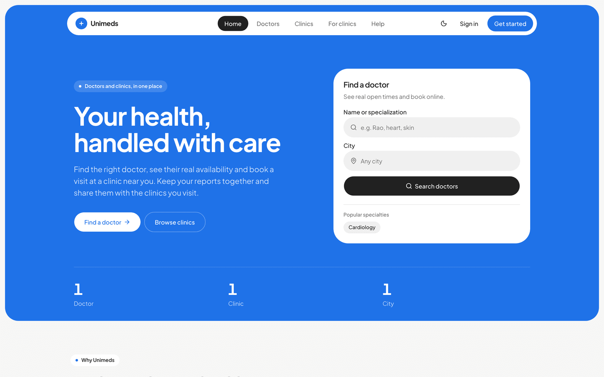

## Screenshots

**Patient and doctor: mobile-first**

| Patient home | Booking | Doctor · today | Doctor · dark |
|---|---|---|---|
| 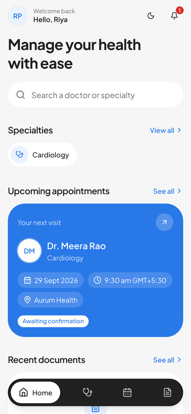 | 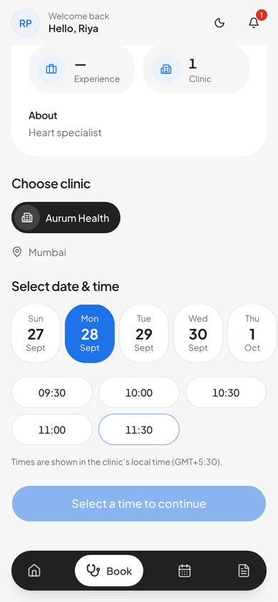 | 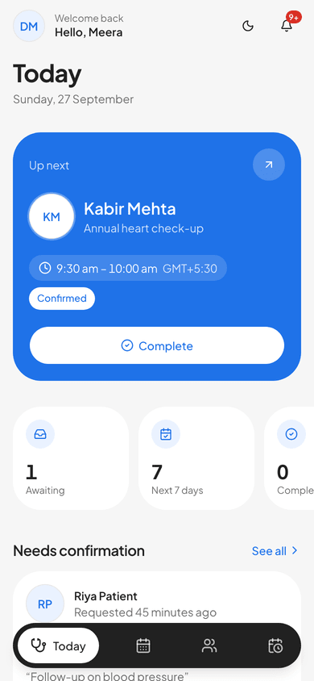 | 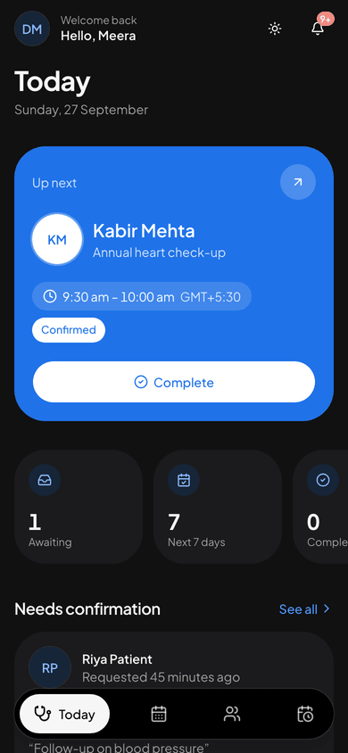 |

**Clinic and platform: desktop**

| Clinic overview | Team |
|---|---|
| 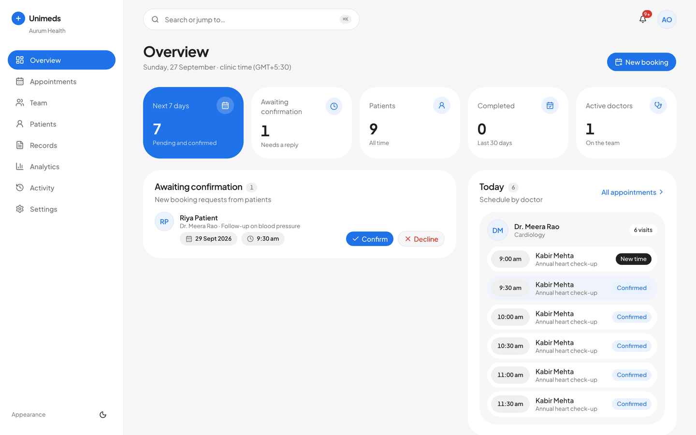 | 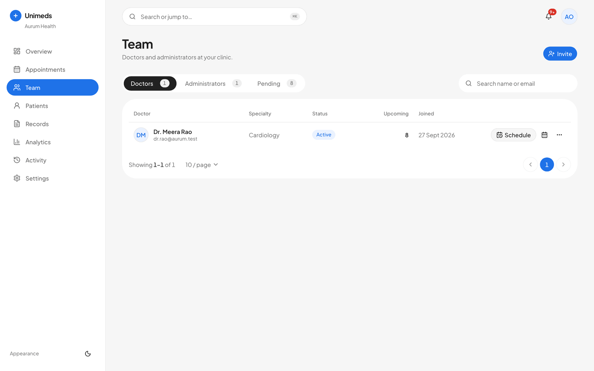 |

| Clinic analytics | Platform overview |
|---|---|
| 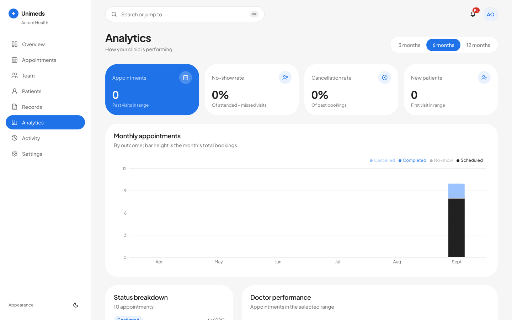 | 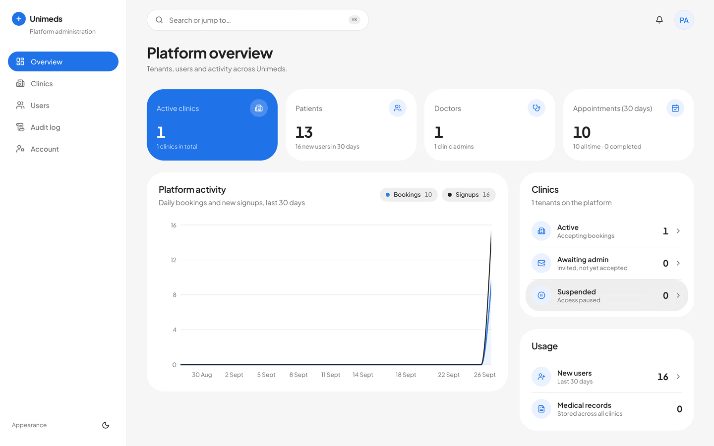 |

| Find a doctor | Sign in |
|---|---|
| 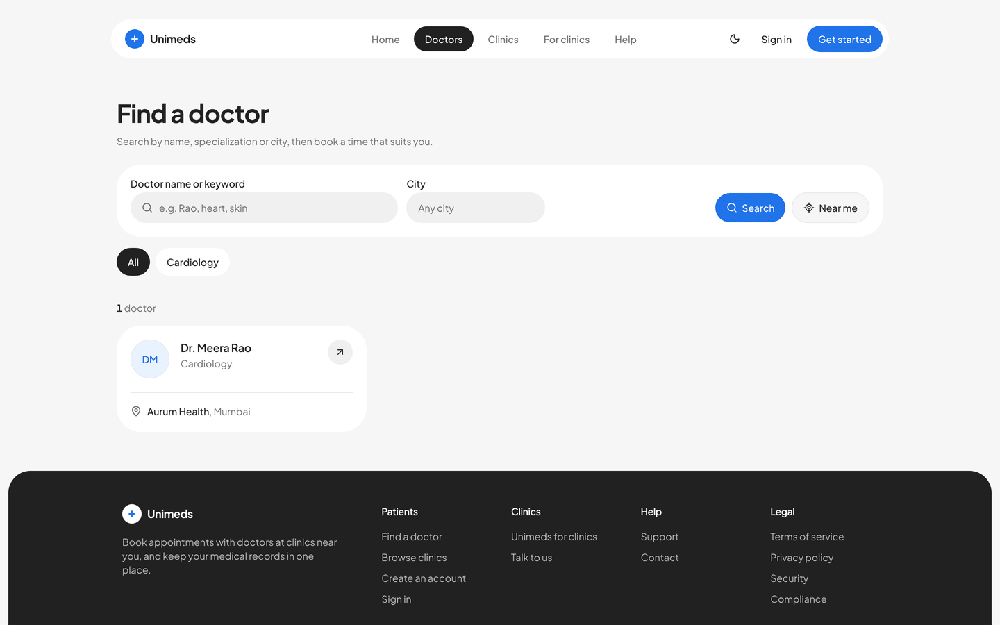 | 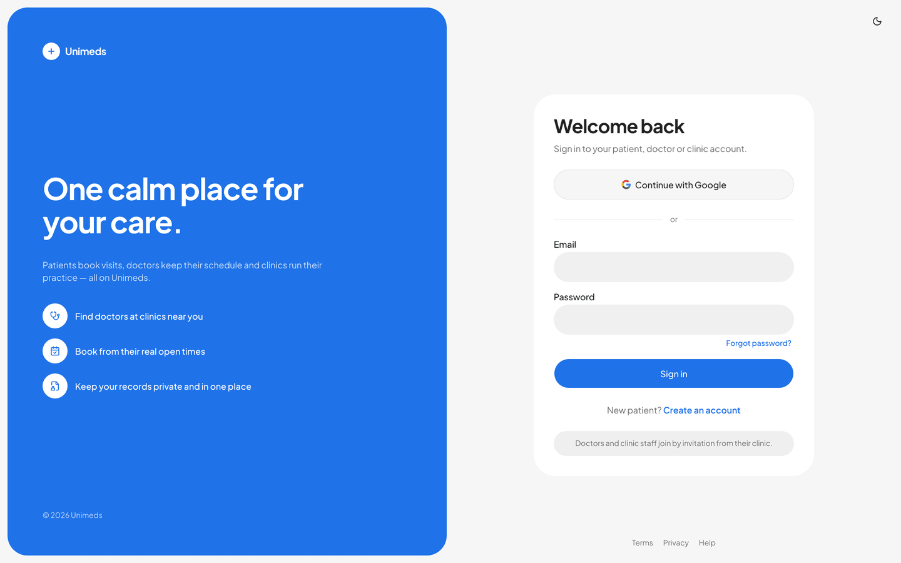 |

## Architecture

```
Browser ──► Next.js 16 (src/) ──/api/backend/*──► Express API (server/) ──► Postgres (Neon)
              NextAuth: Google + email/password                  ├──► Cloudinary (private medical files)
              API token kept in an httpOnly session cookie       └──► SMTP (invites, resets, booking emails)
```

- **Frontend (`src/`):** Next.js 16 App Router, React 19, Tailwind v4, shadcn/ui, TanStack Query.
  - Light theme by default; dark theme via toggle.
  - Patient and doctor screens are mobile-first; clinic and admin screens are desktop-first.
- **API (`server/`):** Express 5, Drizzle ORM, Zod validation, rate limiting, append-only audit log.
- **Security:**
  - The browser never holds the API token.
  - Every request is authorised per role and per clinic.
  - Medical files are private Cloudinary assets, streamed only after an access check.
  - Deactivating a user or changing a password revokes their sessions immediately.
- **Scheduling:**
  - Slots are computed in each clinic's timezone.
  - A database constraint prevents double-booking.
  - Booking-window and cancellation rules are enforced server-side.
- **SEO:** sitemap (including every public doctor and clinic page), `robots.txt`, share images, a web manifest, and structured data (Organization, Physician, MedicalClinic). Private areas are sent with `noindex`.
- **Not wired in yet:** `ai_engine/` (FastAPI OCR / LLM).

## Local setup

Requirements: Node 20+, a Postgres database (Neon works), and optionally Cloudinary and SMTP.

```bash
# API
cd server
cp .env.example .env          # DATABASE_URL, JWT_SECRET, INTERNAL_API_KEY, Cloudinary, SMTP
npm install
npm run db:migrate
SUPER_ADMIN_EMAIL=you@company.com SUPER_ADMIN_PASSWORD='a-long-password' npm run seed:admin
npm run dev                    # http://localhost:8080

# Web
cd ../src
cp .env.example .env           # API_URL, same INTERNAL_API_KEY, AUTH_SECRET, Google OAuth
npm install
npm run dev                    # http://localhost:3000
```

Without SMTP, invite and reset links are logged by the API and shown in the app so you can copy them.

## Getting started in the app

1. As super admin, open **Clinics → Onboard clinic**. The clinic owner gets an invite link.
2. The owner accepts it at `/invite/<token>` and sets a password. This activates the clinic.
3. The clinic admin invites doctors from **Team**. Doctors accept, then set their weekly hours in **Schedule**.
4. Patients sign up (email or Google) and book from **Find a doctor** or the patient app.

## Docs

- [`docs/api.md`](docs/api.md): API contract.
- [`docs/frontend-conventions.md`](docs/frontend-conventions.md): frontend architecture and shared components.
- [`docs/design-guide.md`](docs/design-guide.md): visual design system.
- [`docs/gap-audit.md`](docs/gap-audit.md): the audit behind this rebuild, and what's still deferred.

Regenerate the favicon, app icons and manifest icons from `src/src/app/icon.svg` with `node src/scripts/generate-icons.mjs`.
